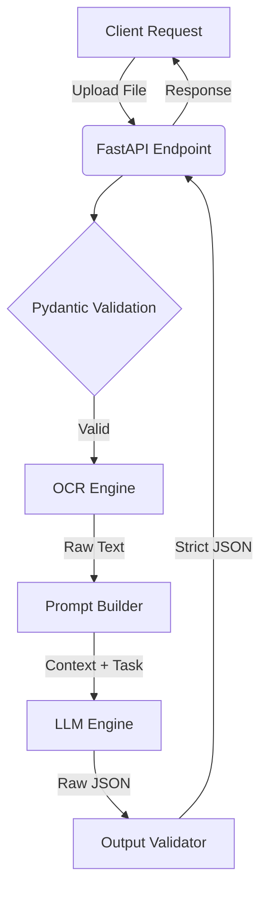

# Smart Document Extractor 📄🧠

An Applied AI API built with Python and FastAPI that processes unstructured documents (PDFs/Images) and extracts structured JSON data using OCR and Large Language Models (LLMs). This repository serves as a portfolio showcase of AI Engineering.

## The Problem
In modern EnergyTech and FinTech, parsing unstructured invoices and technical documents is a manual, error-prone process. Traditional regex-based parsers fail when document layouts change.

## The Solution
This project implements an AI-augmented extraction pipeline. It combines traditional OCR with the reasoning capabilities of LLMs to dynamically map unstructured text into strictly typed JSON schemas, validated with Pydantic before they reach the caller. There is no accuracy benchmark published for this repository yet — the design goal is layout-independent extraction, not a measured accuracy number.

## Architecture

## Stack & Design Principles
- **FastAPI + Pydantic:** High performance asynchronous API with strict type checking.
- **Clean Architecture:** Pipeline heavily utilizes Ports (`OCREngine`, `LLMEngine`) to enforce the Dependency Inversion Principle (DIP).
- **SOLID:** Single Responsibility Principle (SRP) applied—extraction, prompting, and LLM calls are isolated into separate services.

## Endpoints
- `GET /api/health`
- `POST /api/extract` (multipart file)

## Local Setup
\`\`\`bash
docker compose up --build
\`\`\`
- API: `http://localhost:8001`
- Swagger Docs: `http://localhost:8001/docs`

## E2E Testing
\`\`\`bash
python -m pytest app/tests/test_e2e.py
\`\`\`

## Quick Start Example
\`\`\`bash
curl -X POST http://localhost:8001/api/extract \
  -F 'file=@sample.txt;type=text/plain'
\`\`\`
