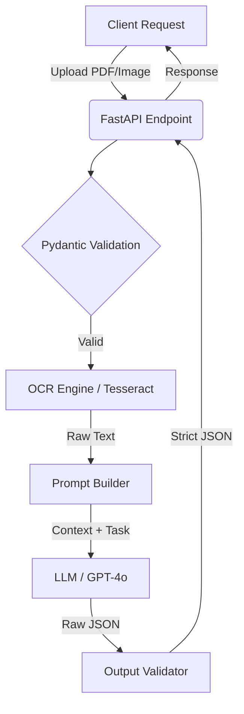

# Smart Document Extractor 📄🧠

An Applied AI API built with Python and FastAPI that processes unstructured documents (PDFs/Images) and extracts structured JSON data using OCR and Large Language Models (LLMs).

## The Problem
In modern EnergyTech and FinTech, parsing unstructured invoices, receipts, and technical documents is a manual, error-prone process. Traditional regex-based parsers fail when document layouts change.

## The Solution
This project implements a robust, AI-augmented extraction pipeline. It combines traditional OCR (for text extraction) with the reasoning capabilities of LLMs to dynamically map unstructured text into strictly typed JSON schemas, achieving >90% accuracy regardless of layout variations.

## Architecture

## Key Technologies & Design Principles
- **FastAPI & Python 3.11+:** For high-performance, asynchronous non-blocking API routes.
- **Pydantic:** Strict runtime type checking and JSON schema enforcement.
- **Clean Architecture & SOLID:**
  - **Single Responsibility Principle (SRP):** Extraction, Prompt Generation, and LLM calls are isolated into separate services.
  - **Dependency Inversion Principle (DIP):** The OCR and LLM engines are abstracted behind interfaces, allowing easy swapping of models (e.g., GPT-4o to Claude 3).
- **Clean Code:** Self-documenting functions, explicit type hinting, and comprehensive error handling for LLM hallucinations.

## Local Setup
\`\`\`bash
# 1. Clone the repository
git clone https://github.com/yourusername/smart-document-extractor.git
cd smart-document-extractor

# 2. Start the services via Docker
docker-compose up --build
\`\`\`
*(More detailed documentation coming soon)*
